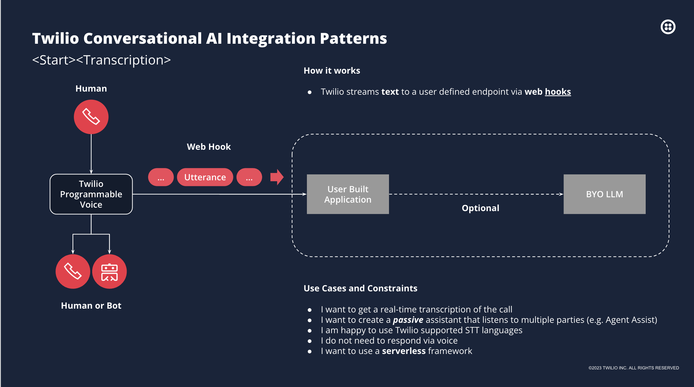
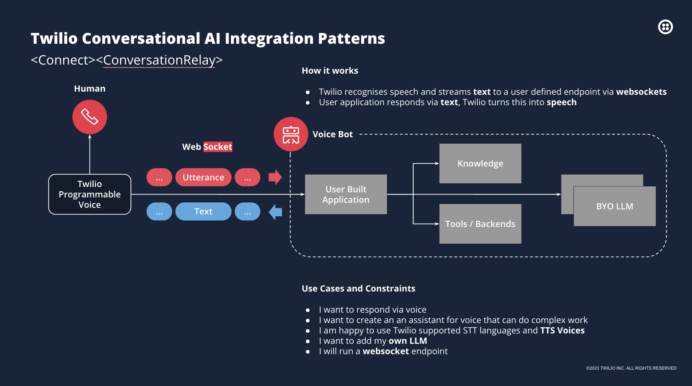
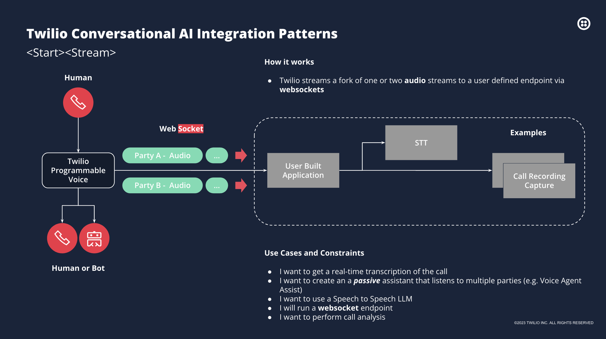
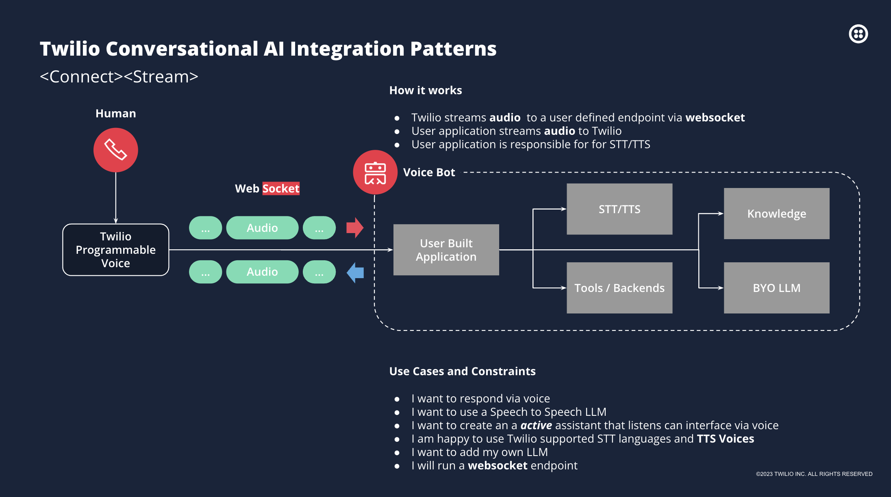
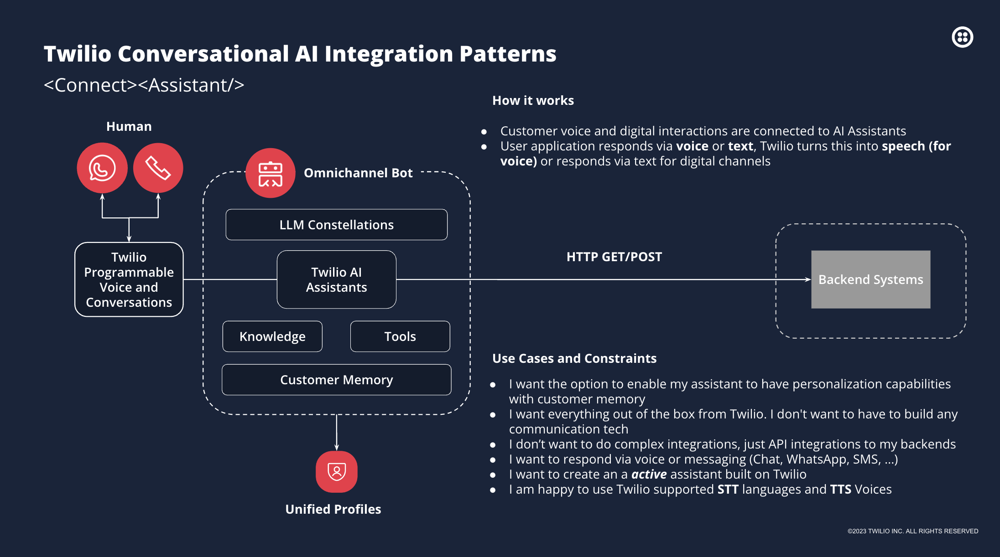

# Twilio Conversational AI Integration Patterns

This set of functions looks at Twilio's AI Integration patterns and how they can be used to build various chatbots. The patterns include Stream, Conversation Relay, Assistant, Connect Stream, and Transcription. Each pattern has its unique features and use cases, making it suitable for different conversational AI applications. This README provides an overview of various integration patterns for Twilio's Conversational AI capabilities.

## Table of Contents

- [Installation](#installation)
- [Running Twilio Functions](#running-twilio-functions)
- [Running the Node.js Server](#running-the-nodejs-server)
- [Setting Up Multi-Tunnel ngrok](#setting-up-multi-tunnel-ngrok)
- [Integration of Externalized Functions](#integration-of-externalized-functions)
- [Patterns Overview](#patterns-overview)
  - [Transcription Pattern](#1-transcription-pattern)
  - [Conversation Relay Pattern](#2-conversation-relay-pattern)
  - [Stream Pattern](#3-stream-pattern)
  - [Connect Stream Pattern](#4-connect-stream-pattern)
  - [Assistant Pattern](#5-assistant-pattern)

## Installation

To install the Twilio Conversational AI Integration Patterns, follow these steps:

```bash
pnpm install
```

NOTE: Ensure that you are using "twilio": "5.3.2" or greater, as this contains the new helper libraries for the Twilio Conversational AI Integration Patterns and the default in Functions is 5.0.3.

## Running Twilio Functions

To run the Twilio functions:

1. Ensure you have set up the environment variables in the `.env` file:
   - `ACCOUNT_SID`: Your Twilio Account SID
   - `AUTH_TOKEN`: Your Twilio Auth Token
   - `WEBHOOK_CALLBACK_URL`: The URL for your webhook callback
   - `SIP_DOMAIN_URI`: Your SIP domain URI

2. Start the Twilio functions:
   ```bash
   cd AIIntegrationPatterns
   twilio serverless:start
   ```

3. The Twilio functions will start, and you'll see output indicating the local URLs for each function.

## Running the Node.js Server

This project includes a Node.js server that handles webhook and websocket API calls. To run the server:

1. Ensure you have set up the environment variables in the `.env` file:
   - `NODE_PORT`: The port on which the server will run (default is 3000)
   - `NODE_SERVER_URL`: The URL of the server (default is 'localhost')
   - `OPENAI_API_KEY`: Your OpenAI API key
   - `OPENAI_MODEL`: The OpenAI model to use (e.g., 'gpt-4')
   - `PROMPT_CONTEXT`: The context for the AI prompt (e.g., 'twilioVoice')
   - `ACCOUNT_SID`: Your Twilio Account SID
   - `AUTH_TOKEN`: Your Twilio Auth Token
   - `AI_ASSISTANT_SID`: Your Twilio AI Assistant SID
   - `TWILIO_FUNCTIONS_URL`: The URL for your Twilio Functions

2. Start the Node.js server:
   ```bash
   node server
   ```

3. The server will start, and you'll see output indicating the URLs for various endpoints:
   - Webhook URL: `http://<NODE_SERVER_URL>:<NODE_PORT>/webhook`
   - Transcription Webhook URL: `http://<NODE_SERVER_URL>:<NODE_PORT>/transcription`
   - Text WebSocket URL: `ws://<NODE_SERVER_URL>:<NODE_PORT>/websocket-text`
   - Audio WebSocket URL: `ws://<NODE_SERVER_URL>:<NODE_PORT>/websocket-audio`

The server is set up to handle both JSON and URL-encoded data, making it versatile for different types of incoming requests.

## Setting Up Multi-Tunnel ngrok

To set up a multi-tunnel ngrok configuration for this project, follow these steps:

1. Install ngrok if you haven't already. You can download it from [ngrok's official website](https://ngrok.com/download).

2. Edit your configurationin your project directory with the following content:

   ```bash
   ngrok config edit
   ```

   ```yaml
   version: 2
   authtoken: 21hkgFaKmvxxxxxxxx
   tunnels:
     functions:
       addr: 3000
       domain: functions-yourdomain.ngrok.dev
       proto: http
     server:
       addr: 3001
       domain: server-yourdomain.ngrok.dev
       proto: http
   ```

   Replace `21hkgFaKmvxxxxxxxx` with your actual ngrok authtoken, and update the `domain` values with your specific ngrok domains. To write the configuration file in pico use Ctrl+O to save and Ctrl+X to exit.

3. Start the multi-tunnel ngrok configuration by running the following command in your terminal:

   ```bash
   ngrok start --all
   ```

   This command will start both tunnels defined in your `ngrok.yml` file.

4. ngrok will display the public URLs for your tunnels. Use these URLs to update your Twilio webhook configurations and any other relevant settings in your project.

Remember to keep the ngrok process running while you're developing and testing your application. The public URLs provided by ngrok will allow external services like Twilio to reach your local development server.

## Integration of Externalized Functions

The project now incorporates externalized functions to enhance the capabilities of the AI service. This integration is managed through the `GptService` class in `services/GptService.js`. Here's an overview of how these components work together:

1. **Context File (`AIIntegrationPatterns/assets/context.md`)**: 
   This file contains the initial context and instructions for the AI agent. It sets the tone, personality, and knowledge base for the AI, focusing on Twilio's Client Voice SDKs.

2. **Tool Manifest (`AIIntegrationPatterns/assets/toolManifest.json`)**: 
   This JSON file defines a set of tools (functions) that the AI can use. Each tool has a name, description, and parameters. The available tools include:
   - `get-customer`: Retrieves customer details based on call information.
   - `place-call`: Places or disconnects calls.
   - `send-sms`: Sends SMS messages.
   - `verify-code`: Verifies a provided code against a calling number.
   - `verify-send`: Generates and sends a verification code via SMS.

3. **Externalized Functions (`AIIntegrationPatterns/functions/tools/`)**: 
   These are the actual implementations of the tools defined in the manifest. They are hosted as Twilio Functions and can be called by the AI when needed.

4. **GptService Integration**:
   - The `GptService` class is initialized with the prompt context and tool manifest.
   - When generating a response, it sends the conversation history, including the new prompt, to the OpenAI API.
   - If the AI decides to use a tool, the `GptService` makes a request to the corresponding Twilio Function.
   - The result of the tool call is then fed back to the AI to generate the final response.

This integration allows the AI to not only provide information based on its training but also to perform actions like retrieving customer data, making calls, sending SMS, and handling verification processes. This significantly enhances the AI's capabilities in handling complex, interactive scenarios in the context of Twilio's voice and messaging services.

## Patterns Overview

### 1. Transcription Pattern



The Transcription pattern focuses on real-time speech-to-text conversion. Key features include:
- Twilio streams text to a user-defined endpoint via web hooks
- Ideal for real-time call transcription and passive assistants
- Compatible with serverless frameworks
- Does not require voice response capabilities

The `start-transcription.js` function demonstrates the implementation of this pattern:

- It creates a Twilio Voice Response object.
- Starts a transcription with a specified webhook callback URL.
    - provide a destination via WEBHOOK_CALLBACK_URL in the environment variables for the transcription events.
- Adds a SIP call to a specified endpoint (This is optional and can be any type of call implementation)
    - You will need to hook up a Twilio Number to a SIP endpoint to test this.
    - Requires a SIP_DOMAIN_URI in the environment variables.
- Handles errors and returns the Voice Response to Twilio.

This function enables real-time transcription of calls, allowing for further processing or analysis of the transcribed text.

The Node.js server handles transcription events through the `/transcription` endpoint. It processes different types of events:
- `transcription-started`: Indicates the start of a transcription.
- `transcription-content`: Contains the actual transcribed content and the audio track it came from.
- `transcription-stopped`: Signals the end of a transcription.
- `transcription-error`: Provides information about any errors that occurred during transcription.

This allows for real-time processing and handling of transcription data as it comes in.

### 2. Conversation Relay Pattern



The Conversation Relay pattern facilitates two-way communication between humans and AI. Key features include:
- Twilio recognizes speech and streams text to a user-defined endpoint via websockets
- User application responds via text, which Twilio converts to speech
- Supports complex AI assistants and integration with custom Language Models (LLMs)

In the current implementation (`connect-conversation-relay.js`), we use `Twilio.Response` instead of `VoiceResponse`. This is because the ConversationRelay helper library is not yet available. The `Twilio.Response` allows us to manually construct the TwiML response as a string, which gives us more flexibility in creating the desired XML structure.

The reason for using `Twilio.Response` is:
1. It allows us to set custom headers, specifically the 'Content-Type' header to 'application/xml'.
2. We can manually construct the TwiML as a string, which gives us full control over the XML structure.
3. This approach doesn't rely on the VoiceResponse helper methods, which may not support all the features we need for the Conversation Relay pattern.

Once the ConversationRelay helper library becomes available, this implementation can be replaced using `VoiceResponse`. This will simplify the code and provide a more idiomatic way of constructing the TwiML response for the Conversation Relay pattern.

The Node.js server handles the Conversation Relay pattern through a WebSocket connection at `/websocket-text`. It processes different types of messages:
- `dtmf`: Handles DTMF (Dual-Tone Multi-Frequency) digits received during the call.
- `setup`: Processes setup messages for initializing the conversation.
- `prompt`: Handles prompt (utterance) messages, which contain the actual speech content.
- `interrupt`: Manages interrupt messages, allowing for handling of user interruptions.
- `dtmf`: Handles DTMF (Dual-Tone Multi-Frequency) digits received during the call.
- `setup`: Processes setup messages for initializing the conversation.

The server integrates with OpenAI's API through the GptService class. This service:
- Initializes the OpenAI client and sets up the conversation context.
- Generates responses to user prompts using the OpenAI Chat Completions API.
- Maintains the conversation history to provide context for each new prompt.
- Utilizes the externalized functions as tools when needed, enhancing its capabilities.

Key aspects of the OpenAI integration:
- The OpenAI model and prompt context are configurable through environment variables.
- The system uses a predefined prompt context to set the initial behavior of the AI.
- Each user prompt and AI response are added to the conversation history for context.
- The AI can use tools defined in the toolManifest to perform actions like retrieving customer data or sending SMS.

This setup allows for real-time, bidirectional communication between the Twilio service and your application, enabling complex conversational AI interactions. The integration with OpenAI's API and the externalized functions allows for dynamic, context-aware responses tailored to each conversation, with the ability to perform real-world actions when necessary.

### 3. Stream Pattern



The Stream pattern allows for real-time audio processing and analysis. Key features include:
- Twilio streams one or two audio streams to a user-defined endpoint via websockets
- Useful for real-time transcription, passive assistants, and call analysis
- Supports Speech to Text (STT) and call recording capture

Implementation details:

1. In `server.js`:
   - The server sets up a WebSocket endpoint at `/connect-stream` to handle incoming audio streams from Twilio.
   - It initializes the `GptRealtimeService` to process the audio stream and generate responses.
   - The server handles various WebSocket events such as 'connected', 'start', 'media', 'dtmf', 'stop', and 'mark'.
   - Audio data received from Twilio is sent to the OpenAI Realtime API via the `GptRealtimeService`.
   - Responses from the OpenAI API are sent back to Twilio through the WebSocket connection.

2. In `services/GptRealtimeService.js`:
   - This service manages the connection to the OpenAI Realtime API.
   - It handles the WebSocket connection to OpenAI, including connection setup, message processing, and error handling.
   - The service processes incoming audio data and sends it to OpenAI for real-time transcription and response generation.
   - It emits events with the generated audio responses, which are then sent back to Twilio by the server.

3. In `AIIntegrationPatterns/functions/connect-stream.js`:
   - This Twilio Function sets up the initial connection for the Stream pattern.
   - It creates a TwiML response that instructs Twilio to connect the call to the WebSocket endpoint on your server.
   - The function determines the correct domain to use (either the local development server or the ngrok tunnel) and constructs the WebSocket URL accordingly.

This implementation allows for real-time, bidirectional audio streaming between Twilio and your application, with integration to OpenAI's Realtime API for advanced natural language processing capabilities.

### 4. Connect Stream Pattern



The Connect Stream pattern allows for bidirectional audio streaming and processing. Key features include:
- Twilio streams audio to a user-defined endpoint via websocket
- User application streams audio back to Twilio
- User application is responsible for STT/TTS processing
- Supports active voice assistants and custom LLM integration

### 5. Assistant Pattern



The Assistant pattern provides a comprehensive solution for AI-driven customer interactions. Key features include:
- Supports both voice and digital channel interactions
- Integrates with LLM Constellations, Knowledge bases, and Tools
- Offers personalization capabilities through Customer Memory
- Enables omnichannel bot functionality

Each pattern offers unique capabilities and is suited for different use cases in building conversational AI applications with Twilio.
